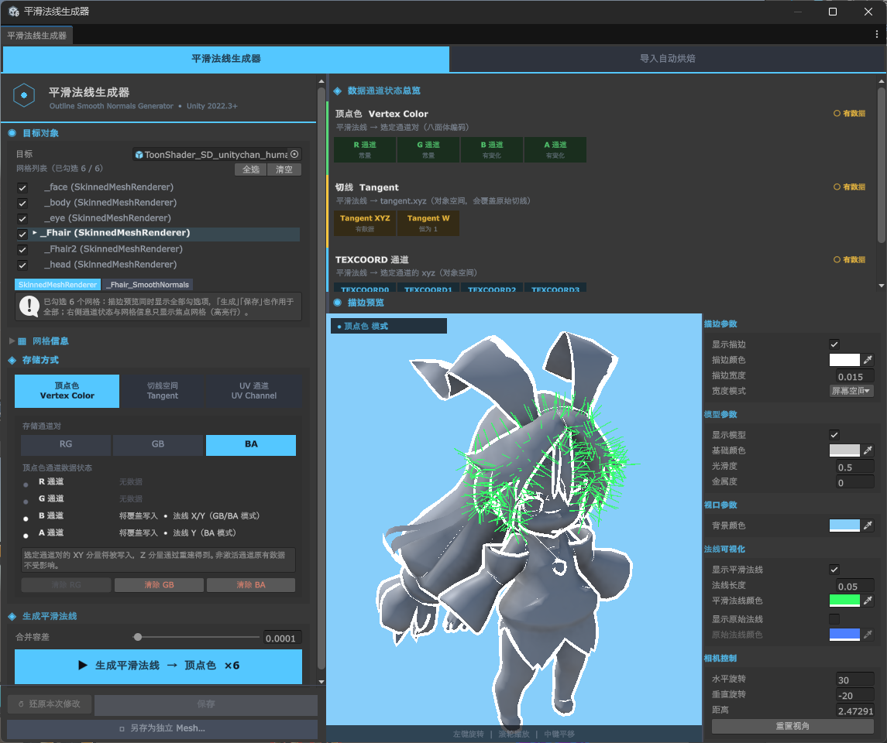
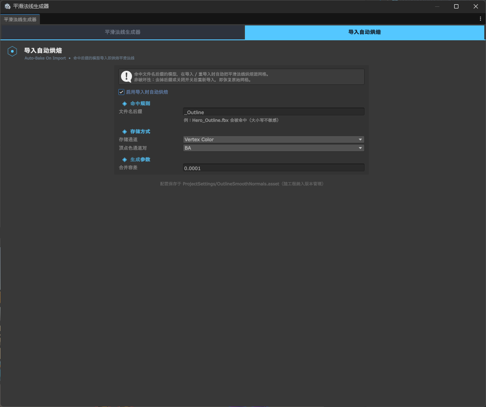

# Outline Smooth Normals Generator — User Guide

<p align="center">
  🌍
  <a href="./README.md">中文</a> |
  English |
  <a href="./README_JA.md">日本語</a>
</p>

Computes **smooth normals** for a mesh and bakes them into the mesh, for backface-extrusion outlines that fix cracking at hard edges.

The tool itself is pure editor C# and is **render-pipeline agnostic**. The outline shaders ship per-pipeline as Samples (URP / Built-in) — import the one you need.

---

## Directory Structure

```
com.alefeng.outlinesmoothnormalsgenerator/
├── package.json
├── CHANGELOG.md
├── LICENSE.md
├── README.md                                        ← Chinese usage doc
├── Editor/
│   ├── OutlineSmoothNormalsGeneratorWindow.cs       ← Main window (with embedded live preview)
│   ├── OutlineSmoothNormalsCalculator.cs            ← Smooth-normal core (angle-weighted + tolerance merge)
│   ├── OutlineSmoothNormalsCodec.cs                 ← Storage-format codec (C# mirror of the .hlsl)
│   ├── StorageWriter.cs                             ← Writes vertex color / tangent / TEXCOORD
│   ├── OutlineNormalsImportProcessor.cs             ← Auto-bake on import (AssetPostprocessor + hooks)
│   ├── OutlineNormalsSettings.cs                    ← Auto-bake config (persisted to ProjectSettings/)
│   ├── OutlineMeshValidator.cs                      ← Mesh health check
│   ├── OutlineShaderGUI.cs                          ← Custom material inspector for the outline shader
│   ├── Shader/OutlinePreview.shader                 ← Editor-preview only
│   └── OutlineSmoothNormalsGenerator.Editor.asmdef
├── Shader/                                          ← ★ Public interface, include it straight into your shader
│   ├── OutlineSmoothNormals.hlsl                    ← THE single source of truth: decode + space resolve + extrusion math
│   ├── OutlinePassCommon.hlsl                       ← Outline Pass template body (not included directly)
│   ├── OutlinePassURP.hlsl                          ← Outline Pass template · URP adapter
│   ├── OutlinePassBuiltIn.hlsl                      ← Outline Pass template · Built-in adapter
│   └── Demo/
│       └── OutlineNPR.hlsl                          ← Demo-only NPR lighting (cel shading + rim), not needed in production
└── Samples~/
    ├── URP/          → Sample "Outline Shader (URP) & Demo"
    └── BuiltIn/      → Sample "Outline Shader (Built-in RP) & Demo"
```

**The four files at the root of `Shader/` are the ones you use directly** — see [Using the Outline In-Game](#using-the-outline-in-game) for how to wire them up. Only the contents of the `Demo/` subfolder exist purely to make the demo scene look nicer; a production shader never has to touch them.

`OutlineSmoothNormals.hlsl` is shared by the editor preview, the Pass templates, and both demo outline shaders. There is exactly one copy of the decode math, so "preview looks right but the real render doesn't" is structurally impossible — and `#include`-ing it instead of copying it out serves the same purpose for your own shader: when the library is upgraded, your shader stays correct with it.

---

## Import an Outline Shader (Required)

> This document targets users who have **already installed the package**. For installation (UPM git URL / copying into `Packages/`), see the repository root README.

The core package **does not include** the outline shader — that would tie the package to a specific pipeline. In Package Manager, select this package → `Samples` → **import the one matching your pipeline**:

| Sample | Shader name |
|---|---|
| Outline Shader (URP) & Demo | `OutlineSmoothNormalsGenerator/Outline URP` |
| Outline Shader (Built-in RP) & Demo | `OutlineSmoothNormalsGenerator/Outline Built-in` |

They can coexist (different names), but a project has only one pipeline, so normally you only need the matching one.

> The tool itself is in the core package; the menu **`Tools > Smooth Normal Generator`** is available right after the package is installed. Importing a Sample only gets you the outline shader — it has nothing to do with whether the tool menu appears.

---

## Quick Start



### 1. Open the Tool

`Tools > Smooth Normal Generator`

### 2. Pick a Target

Select a target and the tool reads it automatically. The target can be:

- A **scene object / model** (`.fbx` / `.obj`, etc.) **/ prefab** — each is **traversed across its whole hierarchy** (including children) to collect every mesh.
- A **Mesh asset** — a standalone `.asset` in the Project, or a Mesh sub-asset under an expanded FBX, used directly.

You can also drag any of the above into the "Target" field manually.

When there are multiple meshes, the target area shows a **scrollable checkbox list** ("Select All / Clear" on top, all selected by default when a new source loads, auto-deduplicated when one mesh is shared by several renderers). **Checking** decides which meshes Generate / Save / Save As act on, and which the preview shows; **clicking a mesh name** makes it the **focus** — the mesh info and channel status on the right reflect the focused mesh.

### 3. Make Sure the Mesh Is Writable

If the mesh comes from a `.fbx` or other model file, it is a **read-only imported sub-asset** — anything written to it is lost on the next reimport. The tool detects this and blocks the save; click **`⧉ Duplicate to standalone Mesh…`** to make a writable `.asset`.

> When a **scene object** is selected, the new `.asset` is reassigned onto the object automatically; when an **asset** (Mesh / model / prefab) is selected there is no component to write back to, so only a standalone `.asset` is created — reference it yourself. A standalone, writable `.asset` mesh is already writable — just save it in step 4, no duplication needed.

### 4. Choose a Storage Mode and Space, then Generate

Pick a [storage mode](#storage-mode) (which channel to write into) and a [storage space](#storage-space) (which space the direction itself is written in — **Tangent Space by default**, and mandatory for skinned meshes), click **`▶ Generate Smooth Normals`**, then **`Save`** to write to disk.

> Both have to be set to the **same values** on the material later, or the outline is wrong — with no error reported.

### 5. Preview

The right side of the window is the live preview (**embedded**, not a separate window), showing all **checked** meshes (multi-selected meshes are laid out at their relative positions in the hierarchy and the camera frames them all; a placeholder is shown when nothing is checked):

- Left-drag to orbit, scroll to zoom, middle-drag to pan
- Toggle **Show Smooth Normals** (green) and **Show Original Normals** (blue) to overlay and compare (focused mesh)
- Adjust outline width / color, model smoothness / metallic, background color

The preview shares the exact same decode and extrusion math as the real render — what you see is what you get.

---

## UI Reference

The tool window has two tabs at the top: **Smooth Normal Generator** (manual workflow) and **Auto-Bake On Import** (see [Auto-Bake on Import](#auto-bake-on-import)). This section walks top-to-bottom through every region of the "Smooth Normal Generator" tab — cross-reference the screenshot in [Quick Start](#quick-start) above: **the left column is the control panel; the right column shows data channel status on top and the live preview & parameters below.**

### Left Panel · Target
- **Target**: the current source object / asset; the `×` on the right clears it. You can drag a scene object, Mesh, model, or prefab directly into this field.
- **Mesh list (N / M selected)**: every mesh discovered from the source. `Select All` / `Clear` on top toggle the checkboxes at once.
  - The **checkbox** decides which meshes are batch-processed — Generate / Save / Save As act on **all checked meshes**, and the preview shows all of them at once.
  - **Clicking a mesh name** makes it the **focus** (highlighted row): the "Mesh Info", "Data Channel Status", and the normal-visualization overlay in the preview all apply only to the focused mesh.
  - Each row is tagged with its renderer type (`MeshFilter` / `SkinnedMeshRenderer`); below the focused mesh, two more tags show its renderer and mesh name.
  - The info bar below states the current checked count and the "batch acts on all, status shows the focus only" rule.

### Left Panel · Mesh Info (collapsible)
Expand to see the focused mesh's **vertex count, triangle count, sub-mesh count**, plus whether it has **normals / tangents / vertex colors** and whether each **TEXCOORD0–7** channel holds data (with component count). Use it to quickly check whether the target channel is already occupied before writing.

### Left Panel · Storage Mode
Three tabs — **Vertex Color / Tangent Channel / UV Channel** — decide where the smooth normal is written (trade-offs in [Storage Mode](#storage-mode); the buttons also carry hover tooltips):
- **Vertex Color**: pick an `RG / GB / BA` channel pair; the "Vertex Color Channel Status" below marks, per channel, the components **about to be overwritten** (e.g. in BA mode B←normal X, A←normal Y), while unselected channels keep their original values; `Clear RG / GB / BA` wipes the data by channel pair.
- **Tangent Channel**: writes the direction straight into `tangent.xyz`; ⚠ this overwrites the original tangent — use "Recalculate Tangents" in the panel to restore real tangents when needed.
- **UV Channel**: choose `TEXCOORD0–7` from the dropdown (each can be cleared individually); choosing `TEXCOORD0` (the main texture UV) asks for confirmation.

### Left Panel · Storage Space
Two more tabs below the storage-mode panel — **Object Space / Tangent Space** — decide which space the direction itself is written in, which is **orthogonal** to which channel it is written into (the reasoning is in [Storage Space](#storage-space); the buttons carry detailed hover tooltips).

- **Tangent Space is the default**, because it is correct for both static and skinned meshes.
- The whole block greys out under **Tangent Channel** storage: there the tangent *is* the data, so there is no basis left to rebuild from — and none needed.
- ⚠ The material's **Smooth Normal Space** must match what you pick here, otherwise the whole outline is skewed and nothing is reported.

### Left Panel · Generate
- The **Merge Tolerance** slider (default `0.0001`; see [Merge Tolerance](#merge-tolerance)).
- The **▶ Generate Smooth Normals** button: its label shows the current storage channel and checked count live (e.g. "→ Vertex Color ×6"); clicking it computes and writes into `sharedMesh` for every checked mesh.
- If the focused mesh has data problems, a **health check** card appears at the top of this region (see [Mesh Health Check](#mesh-health-check)); on errors you're asked to confirm before generating.

### Left Panel Bottom · Save
The `↺ Revert this change`, `Save`, and `⧉ Duplicate to standalone Mesh…` buttons fixed at the bottom — see [Data Safety](#data-safety) for what they do and their caveats.

### Right Panel Top · Data Channel Overview
Three cards — Vertex Color / Tangent / TEXCOORD — mark each channel's status ("has data / empty", etc.; criteria and wording in [Data Status](#data-status)). Always reflects the **focused** mesh.

### Right Panel Bottom · Outline Preview & Parameters
The embedded live preview: **left-drag to orbit, scroll to zoom, middle-drag to pan**. The badge in the top-left (e.g. "● Vertex Color · Tangent Space") is a **read-only** indicator of which channel and which space the preview is decoding from, following the "Storage Mode" and "Storage Space" on the left. The preview shares one decode / extrusion math with the production shader — what you see is what you get. The parameter panel on the right, top to bottom:

| Group | Parameter | Description |
|---|---|---|
| **Outline** | Show Outline | Turn the outline Pass on / off. |
| | Outline Color | The outline's color. |
| | Outline Width | `0.001–0.1`, same scale as the shader's `_OutlineWidth` — directly comparable. |
| | Width Mode | **Screen space** (uniform width, distance-independent) / **World space** (offset in world units, shrinking with distance). |
| **Model** | Show Model | Turn the base model on / off (turn it off to see only the outline). |
| | Base Color / Smoothness / Metallic | Preview material look; Smoothness and Metallic range `0–1`. |
| **Viewport** | Background Color | Preview background color. |
| **Normal Visualization** | Show Smooth Normals | Overlay green smooth-normal line segments. |
| | Normal Length | Segment length, `0.005–0.5`. |
| | Smooth Normal Color | Color of the smooth-normal segments. |
| | Show Original Normals | Overlay blue original normals to compare direction differences at hard edges. |
| | Original Normal Color | Color of the original-normal segments. |
| **Camera** | Yaw / Pitch / Distance | Set the view precisely (you can also drag / scroll in the viewport). |
| | Reset View | Reset the angles and auto-frame all checked meshes. |

> The normal-visualization overlay is drawn only for the **focused** mesh; the preview render shows **all checked** meshes (laid out at their relative positions in the hierarchy when multi-selected).

---

## Storage Mode

The smooth normal has to be written into some block of the mesh's vertex data. All three modes store a **full 3D direction**; they only differ in "which data they occupy, how precise they are, and what they clash with" — choosing one basically comes down to "which data block of this mesh is free?".

| Storage mode | Precision | Footprint | Main clash |
| --- | --- | --- | --- |
| **Vertex Color** | ~1° (octahedral encoding, 8-bit × 2) | Cheapest, 2 byte channels | Overwrites the selected channel pair; collides when the model's vertex colors are already used for something else (AO / masks / wind) |
| **Tangent Channel** | Highest, 3 full floats | The entire `tangent` | ⚠ Overwrites the original tangent → **normal maps break** |
| **UV Channel** | float, no encoding error | One UV channel (3 floats / vertex) | Fewest; ⚠ but `TEXCOORD0` is the main texture UV, and writing there destroys the texture mapping |

Vertex color's 1° error is far below anything outline extrusion can reveal, so **the default is fine**. Stay off the tangent channel if you need normal maps; move to `TEXCOORD1` or later if vertex color is already taken.

> The octahedral encoding is a full-sphere bijection with no hemisphere compression, so there is no sign ambiguity — vertices that coincide at a hard-edge corner with differing normals still decode to one and the same direction. That is exactly why the early "store XY + rebuild Z + take the sign from the normal" scheme cracked the outline open at the very corners it was meant to fix.

---

## Storage Space

The other dimension, **orthogonal** to which channel you write into: which space the direction itself is written in.

| Storage space | What is stored | Works for |
| --- | --- | --- |
| **Object Space** | The object-space direction in bind pose, used as-is after decoding | Static meshes only |
| **Tangent Space** | Coordinates relative to each vertex's own TBN, rebuilt at decode time from the **post-skinning** normal and tangent | Both static and skinned meshes (**default**) |

### Why skinned meshes need tangent space

When a `SkinnedMeshRenderer` skins a mesh, Unity transforms **POSITION / NORMAL / TANGENT**, but **COLOR and TEXCOORD are passed through untouched — they are not skinned**.

So an object-space direction stored in vertex color / TEXCOORD ends up with "the vertices following the bones while the extrusion direction stays in bind pose": the outline tears apart as soon as a joint bends.

Tangent-space coordinates, on the other hand, are a **skinning invariant**: with `S = a·T + b·B + c·N`, skinning applies approximately a rotation `R` to that vertex, and since `N` and `T` are both transformed along with it, `a·T' + b·B' + c·N' = R·S` — exactly the direction it should be after skinning, while `(a, b, c)` never changes. This is the same reason normal maps work on skeletal animation.

### Usage notes

- **The mesh must have valid tangents**: `Tangents` in the model import settings must not be `None`. But this does **not** occupy the tangent, so normal maps still work — the tangent is a *basis* here, not a storage location.
- **Not applicable to tangent-channel storage**: that would overwrite the very tangent the basis rebuild depends on. It is not needed either — Unity skins `tangent.xyz` as a direction, so an object-space direction stored there follows the animation naturally. The tool greys "Storage Space" out automatically in that mode.
- ⚠ **The material must be set to match.** Both spaces store nothing but a unit direction, indistinguishable from the data alone; picking the wrong one raises no error, the outline is simply skewed as a whole.
- ⚠ **Reimporting the model can desynchronize it**: the bake uses the normals / tangents as they were at that moment, so re-importing later with a different tangent-generation method silently invalidates the baked data. **Tangent space is therefore best paired with [Auto-Bake on Import](#auto-bake-on-import)** — the bake happens inside the import pipeline, after tangent generation, so the two always come from the same source.
- Precision is unaffected: what is encoded is still a unit direction, still ~1° in vertex color.

> Where UVs degenerate (three collinear or coincident UVs) the tangent is a zero vector or collinear with the normal and cannot form an orthogonal basis. Such vertices are reported as a ratio by the [Mesh Health Check](#mesh-health-check), and the outline there degrades to extruding along the original vertex normal.

---

## Auto-Bake on Import



Beyond the manual workflow above, the tool can **bake automatically on import**: as soon as a model that matches the rule is (re)imported, smooth normals are written into the mesh — no need to run the tool manually, no need to duplicate a standalone Mesh.

**Non-destructive**: the write happens during import, on the mesh being imported, and persists with the import output; remove the suffix or turn the switch off and reimport to restore the original mesh.

### Enable & Configure

Open the **"Auto-Bake On Import" tab** at the top of the tool window:

| Setting | Description |
|---|---|
| **Enable auto-bake on import** | Master switch, off by default. |
| **Filename suffix** | Match rule: bake when the filename (without extension) ends with this, case-insensitive. Default `_Outline`, e.g. `Hero_Outline.fbx`. |
| **Storage mode** | Vertex color / tangent channel / `TEXCOORD0`–`7`, same meaning as the manual workflow; the shader must read the same channel. See [Storage Mode](#storage-mode). |
| **Storage space** | Object Space / Tangent Space, Tangent Space by default; the shader must use the same space. See [Storage Space](#storage-space). Not applicable under tangent-channel storage — greyed out automatically. |
| **Merge tolerance** | Same as the "Merge Tolerance" section below. |

The config persists to `ProjectSettings/OutlineSmoothNormals.asset`, versioned with the project so the whole team shares one setting.

> After changing the config, already-imported models are not re-baked automatically — just reimport them (right-click `Reimport`) once.

### Extension Hooks (advanced)

For private pipelines that the built-in "filename suffix + three storage modes" can't cover, two static delegates let you take over, falling back to the defaults when unset. Typically assign them once on load with `[InitializeOnLoadMethod]`:

```csharp
using UnityEditor;
using OutlineSmoothNormalsGenerator;

static class MyOutlineAutoBake
{
    [InitializeOnLoadMethod]
    static void Register()
    {
        // Custom match rule: decide by folder / label / import settings, replacing the filename suffix
        OutlineNormalsImportProcessor.ShouldBakeRule = (assetPath, importer) =>
            assetPath.StartsWith("Assets/Characters/");

        // Custom storage: receive the mesh and the object-space smooth normals, encode / write them yourself
        OutlineNormalsImportProcessor.CustomStorageWriter = (mesh, smoothNormals) =>
        {
            // …your own write logic; the shader reads it back in the matching format…
        };
    }
}
```

### Mesh Health Check

Before generating / baking, the tool scans the mesh data and reports anything it can't process or that would affect the result (missing normals, zero / NaN normals, degenerate triangles, too many coincident vertices at one position, Read/Write disabled, etc.). In the manual workflow the report shows as a card at the top of the "Generate" region (with a confirm before generating on errors); during auto-bake it is written to the Console and meshes with errors are skipped.

---

### About TEXCOORD Naming

There are 8 channels (`TEXCOORD0`–`TEXCOORD7`), always referred to as **`TEXCOORDn`**, in **identity correspondence** with the `mesh.SetUVs(n)` index.

Avoiding the "UV1 / UV2" naming is deliberate: Unity's own `mesh.uv2` is actually `TEXCOORD1`, so the name and index are naturally off by one — very easy to get wrong.

> ⚠️ **`TEXCOORD0` is the model's main texture UV** (`mesh.uv`). Writing to it destroys the texture mapping and affects every object referencing that sharedMesh. The default is `TEXCOORD1`; only pick `TEXCOORD0` when that channel is genuinely free (e.g. a procedural mesh), and the tool asks for confirmation.

---

## Merge Tolerance

Vertices at the "same position" are merged and averaged. But seam vertices typically differ by ~1e-6 after DCC export, FBX float truncation, or scaling — with exact equality they wouldn't merge, and the tool would silently fail at exactly the seams where it matters most. Hence the **merge tolerance** (default `0.0001`).

> **Known limitation**: internally the position is quantized to an integer grid by the tolerance. Two points that happen to straddle a grid boundary are still split apart. Fully correct behavior would need neighbor-cell probing or union-find. Rounding is the standard approach, at the cost that **the tolerance must be far smaller than the model's smallest real feature size** — too large a tolerance wrongly merges vertices that should stay separate and deforms the outline.

---

## Data Status

The "Data Channel Overview" on the right shows each channel's status:

- `● Likely smooth normals` — a strong heuristic matched
- `○ Has data` — has data, but can't tell whether it's smooth normals
- `✕ Empty` — the channel has no data

> Why it caps at "**likely**": whether a channel actually holds smooth normals **cannot be determined from the data** — once encoded it's just ordinary numbers, indistinguishable from any vertex color / texture UV. Claiming certainty would be lying. The TEXCOORD heuristic is relatively reliable (this tool writes 3 components, texture UVs are usually 2); vertex color only reports "has / no data".

---

## Data Safety

| Button | Effect |
|---|---|
| `Save` | Writes the changes of **all checked** meshes back to their `.asset`. When a mesh isn't writable it **blocks** and explains why — never a fake success. |
| `⧉ Duplicate to standalone Mesh…` | Copies **all checked** meshes into writable `.asset`s (a name dialog when one is checked; a folder picker + batch when several are), auto-reassigning onto scene objects. The only way out for non-writable meshes. |
| `↺ Revert this change` | Roll back to the state before this generate / clear. |

> **This tool does not rely on Unity's Undo.** `Undo.RecordObject` does not reliably track mesh vertex data, and is entirely ineffective for immutable imported sub-assets. "Revert this change" is the tool's own session snapshot — treat it as authoritative; the snapshot is invalidated when you close the window or switch targets.

Clearing is inside each storage mode's panel (vertex color clears by channel pair; tangent restores real tangents via "Recalculate Tangents"; TEXCOORD clears per channel).

---

## Using the Outline In-Game

### Method 1: Use the Sample shader directly

1. Create a new material for the model and set its shader to `OutlineSmoothNormalsGenerator/Outline URP` (or `... /Outline Built-in`).
2. In **Smooth Normal Source**, pick the **same** storage channel you used when generating (vertex color / tangent channel / `TEXCOORD0`–`TEXCOORD7`). For vertex color mode, also set **Vertex Color Channel** to the same pair used when baking.
3. Set **Smooth Normal Space** to the same [storage space](#storage-space) you generated with (`Tangent Space` by default). ⚠ Getting this one wrong **raises no error** — the outline is simply skewed as a whole, so check it first when the outline looks off.
4. Adjust outline color and width. **Width Mode** can be **screen space** (uniform width, distance-independent) or **world space** (offset in world units, shrinking with distance).

The `VertexNormal` mode extrudes along the raw vertex normals — the "without this tool" look, handy for a direct comparison.

The shader has two passes: `OUTLINE` (front-face-culled extruded outline) + `FORWARD` (basic NPR: two-step cel shading + rim, tunable in the material inspector). The material's **Base Color Mode** also offers a set of **debug options** that show the smooth-normal data directly as color (vertex color / tangent / `UV0`–`UV7`, unlit) for eyeballing the generated result; switch back to **Base Map** for production.

### Method 2: Wire the Pass template into your own shader (recommended)

Real projects usually have their own main material. The package ships a ready-made `OUTLINE` Pass template: **wiring it up takes two steps and you never copy any decode code**; when the library is upgraded later, your shader is updated along with it — no manual patching.

Both demo outline shaders take exactly this path — if the template breaks, the demos expose it immediately.

#### Step 1: Add the 6 outline properties

ShaderLab has no macros, so this `Properties` block has to be copied:

```shaderlab
[Header(Outline)]
_OutlineColor   ("Outline Color", Color) = (0,0,0,1)
[PowerSlider(3.0)]
_OutlineWidth   ("Outline Width", Range(0, 0.1)) = 0.015
[Enum(Screen Space, 0, World Space, 1)]
_OutlineWidthMode ("Outline Width Mode", Float) = 0
_SmoothNormalSrc ("Smooth Normal Source", Float) = 0
[Enum(RG, 0, GB, 1, BA, 2)]
_VCChannel      ("Vertex Color Channel", Float) = 2
[Enum(Object Space, 0, Tangent Space, 1)]
_SmoothNormalSpace ("Smooth Normal Space", Float) = 1
```

`_SmoothNormalSrc` has 11 options, past the `[KeywordEnum]` limit, which is why it carries no `[Enum]`. To get a dropdown, point the `CustomEditor` at the end of your shader to this package's custom inspector:

```shaderlab
CustomEditor "OutlineSmoothNormalsGenerator.OutlineShaderGUI"
```

#### Step 2: Add one Pass

**URP** — copy the whole block:

```shaderlab
Pass
{
    Name "OUTLINE"
    Tags { "LightMode" = "SRPDefaultUnlit" }

    Cull Front          // Draw back faces only; the exposed rim is the outline
    ZWrite On
    ZTest LEqual

    HLSLPROGRAM
    #pragma vertex   OSN_OutlineVert
    #pragma fragment OSN_OutlineFrag

    #include "Packages/com.unity.render-pipelines.universal/ShaderLibrary/Core.hlsl"
    #include "Packages/com.alefeng.outlinesmoothnormalsgenerator/Shader/OutlineSmoothNormals.hlsl"

    CBUFFER_START(UnityPerMaterial)
        // ↓↓ Your own material properties; must be identical to the CBUFFER in every other Pass
        float4 _BaseColor;
        float4 _BaseMap_ST;
        // ↑↑
        OSN_OUTLINE_MATERIAL_FIELDS
    CBUFFER_END

    #include "Packages/com.alefeng.outlinesmoothnormalsgenerator/Shader/OutlinePassURP.hlsl"
    ENDHLSL
}
```

**Built-in** — copy the whole block:

```shaderlab
Pass
{
    Name "OUTLINE"
    Tags { "LightMode" = "Always" }

    Cull Front
    ZWrite On
    ZTest LEqual

    CGPROGRAM
    #pragma vertex   OSN_OutlineVert
    #pragma fragment OSN_OutlineFrag

    #include "UnityCG.cginc"
    #include "Packages/com.alefeng.outlinesmoothnormalsgenerator/Shader/OutlineSmoothNormals.hlsl"

    // Built-in has no SRP Batcher — declare them as plain uniforms, no CBUFFER needed.
    OSN_OUTLINE_MATERIAL_FIELDS

    #include "Packages/com.alefeng.outlinesmoothnormalsgenerator/Shader/OutlinePassBuiltIn.hlsl"
    ENDCG
}
```

#### Four things you must watch out for

- **The include order is fixed.** `OutlineSmoothNormals.hlsl` must come **before** the property declarations (they use macros defined in it), and the Pass template **after** them (its vertex shader uses those uniforms). Get the order wrong and it simply fails to compile.

- **SRP Batcher (URP only): `UnityPerMaterial` must be byte-for-byte identical across all Passes.** One missing entry or a different order makes the batcher **silently fall back** — no error, just lost performance, the hardest kind of bug to track down. That is why the outline properties go into that **one single** CBUFFER via `OSN_OUTLINE_MATERIAL_FIELDS`, and why **every one of your Passes must carry the macro** in the same position.

- **The outline Pass must come before your base rendering Pass.** It runs `Cull Front + ZWrite On`, writing back-face depth first so the front faces can cover the inside properly.

- **`LightMode`**: URP uses `SRPDefaultUnlit`, which gets the outline Pass rendered automatically with no Renderer Feature; Built-in uses `Always`, meaning the Pass is lighting-independent and rendered once per object (`ForwardBase` would drag it into per-light rendering and draw it repeatedly).

Only want to change how the outline color is computed (e.g. tint it from a texture)? Don't edit the template — write your own frag, point `#pragma fragment` at it, and keep using `OSN_OutlineVert`.

---

## Reading the Smooth Normal in a Shader

The Pass template above is enough for most cases. This section is for people who **need full control over the vertex shader** — say the outline has to stack with vertex animation, or the project is vertex-bandwidth sensitive and doesn't want to declare the 8 TEXCOORDs the template does.

**Either way, `#include` the shared library** rather than hand-rolling the decode — that was exactly the source of a string of early "preview doesn't match the real render" defects in this plugin.

### General form (storage mode switchable on the material at runtime)

```hlsl
#include "Packages/com.alefeng.outlinesmoothnormalsgenerator/Shader/OutlineSmoothNormals.hlsl"

// ① Get the smooth normal: decode + space resolve in one call
float3 smoothNormalOS = OSN_GetSmoothNormalOS(
    _SmoothNormalSrc, _SmoothNormalSpace, v.color, v.tangent,
    v.uv0.xyz, v.uv1.xyz, v.uv2.xyz, v.uv3.xyz,
    v.uv4.xyz, v.uv5.xyz, v.uv6.xyz, v.uv7.xyz,
    v.normal, _VCChannel);

// ② Extrude (URP; for Built-in swap the two Transforms for
//    UnityObjectToWorldNormal / UnityObjectToClipPos)
float3 normalWS = TransformObjectToWorldNormal(smoothNormalOS);
float4 clipPos  = TransformObjectToHClip(v.positionOS.xyz);
o.positionCS    = OSN_ApplyOutlineOffset(clipPos, normalWS, _OutlineWidth, _OutlineWidthMode);
```

Internally `OSN_GetSmoothNormalOS` is two steps: "decode → resolve by storage space". Those two **must always come as a pair**, and skipping the second one raises no error at all — the outline is simply skewed as a whole — which is why they were merged into one function. If you really do need them separately, they are `OSN_SelectSmoothNormalOS` and `OSN_ResolveSmoothNormalSpace`.

`OSN_ApplyOutlineOffset` handles three things that are easy to get wrong: transforming the normal with the inverse-transpose matrix (otherwise the outline skews under non-uniform scale), taking the offset direction in **clip space** (otherwise it's affected by FOV / aspect ratio), and guarding against a zero-length direction (otherwise a normal facing straight at the camera makes `normalize` produce NaN and the GPU drops the whole triangle). The last argument is the width mode: `0` screen space (uniform width), `1` world space (shrinking with distance).

### Minimal form (storage mode hard-coded in the shader)

Production projects usually settle on one storage mode project-wide. There is then no need to keep the runtime switch on the material, and therefore no need to declare 8 TEXCOORDs — just call the matching decoder, with zero branching:

```hlsl
// e.g. the whole project uses "vertex color BA + tangent space"
// The vertex input only needs POSITION / NORMAL / TANGENT / COLOR — not a single UV
float3 smoothNormalOS = OSN_OctDecode(v.color.ba);                       // decode vertex color BA
smoothNormalOS = OSN_TangentToObject(smoothNormalOS, v.normal, v.tangent); // tangent space → object space
```

Object-space storage drops the second line. For TEXCOORD storage replace the first line with `normalize(v.uv1.xyz)`; for tangent-channel storage replace it with `normalize(v.tangent.xyz)` (that mode is always object space, so the second line isn't needed either).

`Smooth Normal Source` / `Smooth Normal Space` in the material inspector are dead weight at that point and the two properties can be left undeclared — but **do write a comment in the shader stating which combination you hard-coded**, or there will be no trail to follow when the storage mode changes later.

### If You'd Rather Not include at All

Tangent-channel and TEXCOORD modes **under object-space storage** hold the object-space direction directly — just normalize it:

```hlsl
float3 smoothNormalOS = normalize(v.tangent.xyz);  // or normalize(v.uv1.xyz)
```

Vertex color mode is octahedral-encoded and needs decoding:

```hlsl
float3 OctDecode(float2 f)
{
    f = f * 2.0 - 1.0;
    float3 n = float3(f.x, f.y, 1.0 - abs(f.x) - abs(f.y));
    float  t = saturate(-n.z);
    n.xy += (n.xy >= 0.0) ? -t : t;
    return normalize(n);
}
// BA channel pair:
float3 smoothNormalOS = OctDecode(v.color.ba);
```

⚠ If you baked with the default **tangent space**, you still have to rebuild the TBN and resolve it yourself — which is exactly what `OSN_TangentToObject` does, and hand-rolling it easily goes wrong on Gram-Schmidt re-orthogonalization and the `tangent.w` handedness. **This route is not recommended**: code copied out doesn't follow library upgrades — when `1.5.0` added storage spaces, every hand-copied shader had to be patched by hand, and missing it raises no error, the outline just quietly goes crooked.

---

## Caveats

- Smooth-normal computation is based on **vertex position merging**, tolerance default `0.0001` (see "Merge Tolerance" above).
- Modifying `sharedMesh` affects **every** object using that mesh. To affect a single object only, duplicate it first with "Duplicate to standalone Mesh".
- **Tangent-channel mode overwrites the mesh's original tangents**, so shaders sampling a normal map get a wrong TBN.
- `Editor/Shader/OutlinePreview.shader` is for editor preview only — don't use it in production. If it's missing (usually an incomplete package install), the preview degrades to flat color with no outline offset.
- What is stored is always a **full 3D direction**, with no hemisphere compression; whether it lives in object space or tangent space is decided by [Storage Space](#storage-space).
- ⚠ **Upgrading from `1.4.x`**: as of `1.5.0` the storage space defaults to tangent space, and the material's **Smooth Normal Space** defaults to `Tangent Space` accordingly — while all older data was baked in object space. Either **re-bake once**, or set that material property back to `Object Space`. Models going through [Auto-Bake on Import](#auto-bake-on-import) are re-baked automatically, no action needed.
- Meshes baked with an internal version prior to `1.0.0` must be **re-baked**.

---

## License

MIT License — free for commercial and non-commercial use.
