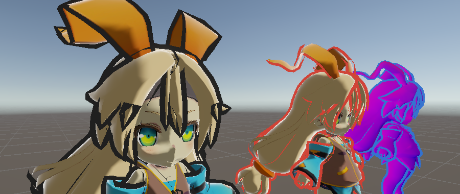

<p align="center">
  
  
  
  
  
</p>

<p align="center">
  🌍
  <a href="./README.md">中文</a> |
  English |
  <a href="./README_JA.md">日本語</a>
</p>

<p align="center">
  📥
  <a href="#-installation">Installation</a> |
  <a href="#-quick-start">Quick Start</a> |
  <a href="Packages/com.alefeng.outlinesmoothnormalsgenerator/README.md">Full Docs</a>
</p>

# Outline Smooth Normals Generator
Outline Smooth Normals Generator is a `Unity` **editor tool** that automatically computes **smooth normals** for a mesh and bakes them into the vertex color, tangent, or a UV channel.  
It specifically solves the problem of **backface-outline cracking at hard edges**: toon / anime styles commonly generate outlines by "duplicating the model, extruding along the normals, and rendering only the back faces." But at cube corners, mechanical edges and other places where **normals are split**, the per-vertex normal directions are discontinuous, so the outline breaks apart and shows gaps.  
This tool takes the **vertices that share the same position** and computes a single **continuous extrusion direction** from an angle-weighted average of their face normals (the smooth normal). The original normals are kept for shading, while the outline closes smoothly along the model's silhouette.  
The tool itself is pure editor C# and is **render-pipeline agnostic**. The outline shaders are shipped per-pipeline as Samples (URP / Built-in) — import the one you need — so the package itself pulls in no pipeline dependency. A live outline preview is embedded in the tool window: what you see is what you get.


## 📜 Table of Contents
- [Outline Smooth Normals Generator](#outline-smooth-normals-generator)
  - [📜 Table of Contents](#-table-of-contents)
  - [Introduction](#introduction)
    - [Features](#features)
    - [Why Smooth Normals](#why-smooth-normals)
  - [💻 Requirements](#-requirements)
  - [📦 Installation](#-installation)
    - [Via UPM (recommended)](#via-upm-recommended)
    - [Import an outline shader (required)](#import-an-outline-shader-required)
    - [Other methods](#other-methods)
  - [🚀 Quick Start](#-quick-start)
    - [1. Open the Tool](#1-open-the-tool)
    - [2. Pick a Target and Storage Mode](#2-pick-a-target-and-storage-mode)
    - [3. Generate and Preview](#3-generate-and-preview)
    - [4. Save](#4-save)
  - [📥 Auto-Bake on Import](#-auto-bake-on-import)
  - [🧩 Three Storage Modes](#-three-storage-modes)
  - [🧭 Storage Space](#-storage-space)
  - [🎨 Using the Outline In-Game](#-using-the-outline-in-game)
  - [📖 Full Documentation](#-full-documentation)
  - [📁 Project Structure](#-project-structure)
  - [📋 Roadmap](#-roadmap)
  - [📄 License](#-license)

## Introduction
Outlines are one of the most common needs in toon rendering. The most universal implementation is the **backface-extrusion method**: the model is "inflated" outward along its vertex normals, and only the back faces are rendered, so the exposed rim becomes the outline.  
This approach is simple and efficient, but it depends heavily on the **continuity** of vertex normals. When a model has hard edges (adjacent faces sharing a position but with different normals, i.e. split normals), a single position carries several normals pointing in different directions; after extrusion they spread apart, and the outline **cracks and breaks** at corners.  

Outline Smooth Normals Generator solves this with an editor workflow:

1. **Compute smooth normals** — group the mesh vertices that share the **same position**, and take an **angle-weighted average** of the face normals they belong to, producing a single continuous "extrusion direction" that spans across hard edges.
2. **Bake into the mesh** — write the smooth normal into one of **vertex color / tangent / UV**, without touching the original normals used for lighting.
3. **Sample & extrude in the shader** — the outline shader reads this smooth normal in the vertex stage and applies a screen-space, uniform-width offset, yielding a smooth, closed outline.

The whole process happens inside the editor, with **live preview, normal-visualization comparison, channel-status checks, Undo, and per-channel clearing**.


### Features
| Feature | Description |
| --- | --- |
| Angle-weighted smooth normals | Groups vertices by "equal position" and averages face normals weighted by angle, producing a continuous extrusion direction across hard edges that eliminates outline cracking at the source. Also auto-corrects winding orientation for back-facing / double-sided meshes. |
| Three storage modes | **Vertex color** (selectable RG / GB / BA channel pair, octahedral-encoded), **tangent channel** (`tangent.xyz`), and **TEXCOORD0–7** (8 channels, two-component octahedral encoding, 2 floats / vertex). All store a full 3D direction — the octahedral encoding is a full-sphere bijection, so there is no sign ambiguity. |
| Two storage spaces | Orthogonal to the channel choice: **object space** (the direction under the bind pose, used straight after decoding) or **tangent space** (coordinates relative to each vertex's own TBN, rebuilt at decode time from the **skinned** normal and tangent — the default). Tangent space keeps outlines intact on `SkinnedMeshRenderer` meshes, and does not consume the tangent, so normal maps keep working. |
| Auto-bake on import | Models matching the rules — **by filename suffix** (default `_Outline`) and **by folder path**, intersected when both are enabled — get smooth normals baked automatically on (re)import — **non-destructive**, no manual step. Configured in the tool's "Auto-Bake On Import" tab (stored under `ProjectSettings/`), with two extension delegates for custom match rules / custom storage. |
| Mesh health check | Before generating / baking, scans and reports issues — missing normals, degenerate triangles, NaN, too many coincident vertices at one position, Read/Write disabled — with a confirm-before-generate on errors and auto-skip during auto-bake. |
| Live outline preview | Embedded preview viewport with left-drag orbit / scroll zoom / middle-drag pan; adjust outline width, color, plus model smoothness / metallic / base color and background color in real time. |
| Normal visualization compare | Overlay both the "smooth normal" and "original normal" line segments at once to directly compare the direction difference at hard edges and validate the result instantly. |
| Scene-view normal overlay | Draw the same two overlays into the Scene view on the real objects; a `SkinnedMeshRenderer` is evaluated in its **current pose**, so tangent-space data can be verified while an animation plays. Dense meshes are decimated automatically, with the sampling ratio stated on the panel. |
| Data channel overview | Shows in real time whether each channel is "● has smooth normals / ○ has raw data / ✕ empty", so you don't accidentally overwrite existing vertex-color or UV data. |
| Mesh info panel | At-a-glance vertex count, triangle count, sub-mesh count, and whether normals / tangents / vertex colors / each UV channel are present. |
| Data safety | **Blocks fake saves to read-only imported assets**, and offers "Duplicate to standalone Mesh" — one click copies a writable `.asset` and reassigns it onto the object. Plus a session snapshot: "Revert this change". |
| Merge tolerance | Seam vertices typically differ by ~1e-6 after DCC export / FBX float truncation; the tolerance (default 0.0001) still merges them correctly. |
| Outline shaders (Samples) | URP and Built-in versions shipped separately, each two-pass (outline + basic NPR shading) with a custom material inspector; switch the normal source, the storage space, and the outline width mode (screen / world space). |
| Broad compatibility | The target can be a scene object (`MeshFilter` / `SkinnedMeshRenderer`) or a Mesh / model / prefab asset in the Project; the generation logic is render-pipeline agnostic. |
| Trilingual UI | The editor UI ships in **简体中文 / English / 日本語**, with a switch in the header of each tab; Chinese is the default. The preference lives in `EditorPrefs` (per machine, never version-controlled). For precision, English terms such as `TEXCOORD1`, `SkinnedMeshRenderer` and `Smooth Normal Space` are **kept verbatim in all three languages**. Parameters come with hints and status indicators. |

### Why Smooth Normals
- **Plain-normal outline**: at hard edges the per-vertex normal directions disagree, so after extrusion the outline is misaligned and cracked — most visible at corners.
- **Smooth-normal outline**: vertices at the same position share one extrusion direction, so the outline closes smoothly along the silhouette; meanwhile shading still uses the original normals, so **normal lighting and normal maps are unaffected**.

The smooth normal is therefore stored only as extra "extrusion direction" data in a spare channel — a low-cost, non-intrusive solution.

## 💻 Requirements
- `Unity 2022.3` or newer (verified on `2022.3` and `6000.3`; this repository is maintained on `6000.3`).
- The **generation tool** (smooth-normal computation and writing) is pure editor C# and **does not depend on any render pipeline** — Built-in / URP / HDRP can all be used to bake the data.
- **The outline shaders ship per-pipeline as Samples** (URP / Built-in). The core package contains no shader, hence no pipeline dependency. HDRP isn't provided yet — see the [full documentation](Packages/com.alefeng.outlinesmoothnormalsgenerator/README.md) to port the outline Pass yourself; the decode logic is universal, only the render Pass needs adapting.
- `OutlinePreview.shader` is for in-editor preview only; do not use it in production.

## 📦 Installation
### Via UPM (recommended)
`Window > Package Manager` → `+` (top-left) → `Install package from git URL...` → paste:

```
https://github.com/AleFeng/OutlineSmoothNormalsGenerator.git?path=/Packages/com.alefeng.outlinesmoothnormalsgenerator
```

This installs the latest commit on `main`. **To pin a version, append `#<tag>` at the very end of the URL** — it must come after `?path=`:

```
https://github.com/AleFeng/OutlineSmoothNormalsGenerator.git?path=/Packages/com.alefeng.outlinesmoothnormalsgenerator#1.8.1
```

See [Releases](https://github.com/AleFeng/OutlineSmoothNormalsGenerator/releases) for available tags.

### Import an outline shader (required)
The core package **does not include** the outline shader. After installing, select the
package in Package Manager → `Samples` → **import the one matching your pipeline**:

| Sample | Shader name |
| --- | --- |
| Outline Shader (URP) & Demo | `OutlineSmoothNormalsGenerator/Outline URP` |
| Outline Shader (Built-in RP) & Demo | `OutlineSmoothNormalsGenerator/Outline Built-in` |

They can coexist (different names), but a project has only one pipeline, so normally you
only need the matching one. Each Sample includes a comparison demo scene.

### Other methods
You can also download the repo and copy the whole `Packages/com.alefeng.outlinesmoothnormalsgenerator`
folder into your project's **`Packages/` directory** (not `Assets/`) — Unity picks it up
automatically as a local package.

`Samples~` won't be imported by Unity (directories ending in `~` are ignored), so copy the
contents of `Samples~/URP/` (or `Samples~/BuiltIn/`) anywhere under `Assets/` manually.
**The shader needs no edits** — the `Packages/…` path it uses for the shared library resolves
under this layout too.

Once installed, the menu bar shows **`Tools → Smooth Normal Generator`**.

## 🚀 Quick Start
Below is the shortest path. **The complete parameter reference and shader sampling code are in the [full documentation](Packages/com.alefeng.outlinesmoothnormalsgenerator/README.md).**

### 1. Open the Tool
Menu bar → `Tools → Smooth Normal Generator` to open the "Smooth Normal Generator" window.

### 2. Pick a Target and Storage Mode
- Select a target and the tool reads it automatically. It can be a **scene object** (with `MeshFilter` / `SkinnedMeshRenderer`), or a **Mesh asset**, **model** (`.fbx`, etc.), or **prefab** in the Project; you can also drag it into the "Target" field manually. Selecting a scene object, model, or prefab **traverses the whole hierarchy** to collect every mesh in it; when there is more than one, the target section shows a **checkbox list** ("Select All / Clear" on top, all selected by default) — **check multiple meshes to edit them together**: Generate / Save / Save As act on every checked mesh, and the preview shows all checked meshes at once.
- In "Storage Mode", choose **Vertex Color / Tangent Channel / TEXCOORD** (see [Three Storage Modes](#-three-storage-modes)). The "Data Channel Overview" on the right tells you whether the target channel already holds data.
- Right below it, in "Storage Space", choose **Object Space / Tangent Space** — *which space* the direction is written in, orthogonal to *which channel* it goes into. **Tangent Space is the default** and is mandatory for skinned meshes. Both settings must be mirrored on the material later.

### 3. Generate and Preview
- Click **`▶ Generate Smooth Normals`** to write the data into `sharedMesh`.
- Inspect the result live in the "Outline Preview" viewport: left-drag to orbit, scroll to zoom, middle-drag to pan, and toggle "Show Smooth Normals / Original Normals" to overlay and compare. The preview shares the exact same decode math as the real render — what you see is what you get.
- Not happy with the result? Click **`↺ Revert this change`**.

### 4. Save
Click the **`Save`** button at the bottom-left to write the changes back to the `.asset`.

> ⚠️ **A mesh inside a `.fbx` (or other model file) is a read-only imported sub-asset** — anything written to it is lost on the next reimport. The tool detects this and blocks the save; click **`⧉ Duplicate to standalone Mesh…`** first to make a writable `.asset`. When the target is a **scene object** it is reassigned onto the object automatically; when the target is an **asset** (Mesh / model / prefab) only the standalone `.asset` is created — reference it yourself.
>
> ⚠️ Modifying `sharedMesh` affects every object referencing that mesh. To affect a single object only, use the same duplicate flow.

<!--  Quick start: select → generate → preview -->

## 📥 Auto-Bake on Import
Beyond the manual workflow above, the tool can **bake automatically on import**: give the model file a matching suffix (default `_Outline`, e.g. `Hero_Outline.fbx`) and/or put it under a configured folder, and smooth normals are written into the mesh the moment it is (re)imported — no need to open the tool, no need to duplicate a standalone Mesh. **Non-destructive**: stop matching or turn the switch off and reimport to restore the original mesh.

Enable and configure it in the **"Auto-Bake On Import" tab** at the top of the tool window: the enable switch, the match rules (**by filename suffix** and **by folder path** — each can be toggled on its own, and enabling both takes the intersection), storage mode (vertex color / tangent channel / `TEXCOORD0`–`7`), storage space (object / tangent, tangent by default), and merge tolerance. The config persists to `ProjectSettings/OutlineSmoothNormals.asset`, versioned with the project so the whole team shares one setting.

Tangent-space storage pairs especially well with auto-baking: the bake happens inside the import pipeline, right after the tangents themselves are generated, so the baked data can never silently go out of sync with the tangents it was built on.


A **mesh health check** runs before generating / baking (missing normals, degenerate triangles, NaN, too many coincident vertices at one position, etc.); issues are reported immediately and meshes with errors are skipped. To hook a private pipeline by folder / label, or use a custom storage format, two extension delegates let you take over — see the [full documentation](Packages/com.alefeng.outlinesmoothnormalsgenerator/README.md#导入时自动烘焙).

## 🧩 Three Storage Modes
Smooth normals are always stored as a **full 3D direction** — no hemisphere packing, hence no sign ambiguity and no mis-decoding at hard-edge corners. Which *space* that direction is written in is a separate choice, defaulting to tangent space (see [Storage Space](#-storage-space)).

| Mode | Storage location | When to use |
| --- | --- | --- |
| **Vertex Color** | RG / GB / **BA** (default) channel pair of `color`, octahedral-encoded | First choice when vertex color is free. Two 8-bit components, ~1° error. |
| **Tangent Channel** | `tangent.xyz` (`w` is always 1) | Full float precision. ⚠ **Overwrites the original tangent and breaks normal mapping** — only use it when the mesh has no normal map. |
| **TEXCOORD** | `xy` of `TEXCOORD0`–`TEXCOORD7`, octahedral-encoded | Recommended when vertex color is occupied; 8 channels. Two-component octahedral encoding (2 floats / vertex), ~5e-6° error. |

> Channels are always named `TEXCOORDn`, identity-mapped to the `mesh.SetUVs(n)` index — Unity's own `mesh.uv2` is actually `TEXCOORD1`, so the "UV1/UV2" naming is trivially off by one.
>
> ⚠️ **`TEXCOORD0` is the main texture UV.** Writing to it destroys the texture mapping. The default is `TEXCOORD1`; writing to `TEXCOORD0` requires an explicit confirmation.

> ⚠️ **Breaking change when upgrading from `1.6.x` and earlier**: as of `1.7.0` the TEXCOORD channels store a **two-component octahedral encoding** (previously the raw three-component direction), so data baked by `1.6.x` or earlier can no longer be decoded and must be **re-baked**. Vertex color and tangent channel storage are byte-for-byte unchanged and unaffected. Full migration steps: [full documentation](Packages/com.alefeng.outlinesmoothnormalsgenerator/README.md#从-16x-及更早升级).

## 🧭 Storage Space
A second dimension, **orthogonal** to which channel the data goes into: *which space* the direction itself is written in.

| Space | What is stored | When it is correct |
| --- | --- | --- |
| **Object Space** | The object-space direction under the bind pose; used straight after decoding | Static meshes only |
| **Tangent Space** | Coordinates relative to each vertex's own TBN, rebuilt at decode time from the **skinned** normal and tangent | Both static and skinned meshes (**default**) |

When a `SkinnedMeshRenderer` is skinned, Unity transforms POSITION / NORMAL / TANGENT, but **COLOR and TEXCOORD are passed through untouched**. An object-space direction parked in vertex color or a TEXCOORD therefore stays in the bind pose while the vertices follow the bones, and the outline tears open as soon as a joint bends. Tangent-space coordinates are a skinning invariant — the same reason normal maps work on skeletal animation — which is why they are the default. The tangent is only used as a *basis* here, not as storage, so normal maps keep working; the model just needs `Tangents` ≠ `None` in its import settings. The option does not apply to **Tangent Channel** storage (which overwrites the very basis needed to rebuild it) and is greyed out there.

> ⚠️ The storage space selected in the tool and in the material **must match**, otherwise the outline is globally skewed without any error being raised.

> ⚠️ **Breaking change when upgrading from `1.4.x`**: everything baked by `1.4.x` and earlier is in object space, while `1.5.0` materials default to `Tangent Space` — the outline comes out globally skewed with **no compile-time or runtime error of any kind**. Either **re-bake once** (recommended, and you gain skinning support) or set the material's **Smooth Normal Space** back to `Object Space`. Models handled by [Auto-Bake on Import](#-auto-bake-on-import) are re-baked automatically, no action needed. See the [full documentation](Packages/com.alefeng.outlinesmoothnormalsgenerator/README.md#存储空间) for details.

## 🎨 Using the Outline In-Game
After importing the Sample for your pipeline (two passes: Pass0 backface-extrusion outline + Pass1 basic NPR shading):

1. Create a new material and set its shader to `OutlineSmoothNormalsGenerator/Outline URP` (or `... /Outline Built-in`).
2. In the material inspector's **Smooth Normal Source**, pick the **same** storage channel you used when generating; for vertex color mode, also set **Vertex Color Channel** to the same pair.
3. Set **Smooth Normal Space** to the same [storage space](#-storage-space) you baked with (default `Tangent Space`). ⚠ Getting this one wrong produces **no error at all** — the outline is merely skewed as a whole, so check it first whenever an outline looks off.
4. Adjust outline color and width. The **width mode** can be **screen space** (uniform width, independent of distance) or **world space** (offset in world units, shrinking with distance).

The `VertexNormal` mode extrudes along the raw vertex normals — the "without this tool" look, handy for a direct comparison.

If you use your own main material, the package ships a ready-made **`OUTLINE` Pass template**, and wiring it up takes only two steps: add the 6 outline properties to your `Properties` block, then copy in a dozen-line `Pass{}` (one version for URP, one for Built-in) — no decode code to copy by hand, and your shader keeps up automatically whenever the library is upgraded. Both outline shaders in the Demo take exactly this route. For the full steps, the caveats, and the way to write it when you need complete control over the vertex shader, see the [full documentation](Packages/com.alefeng.outlinesmoothnormalsgenerator/README.md#在游戏中使用描边).

## 📖 Full Documentation
This README is the overall introduction and quick start. **The complete usage guide** — details of each storage mode, channel selection, shader sampling code, clearing data, caveats, etc. — lives in the in-plugin documentation:

👉 **[Packages/com.alefeng.outlinesmoothnormalsgenerator/README.md](Packages/com.alefeng.outlinesmoothnormalsgenerator/README.md)** (Chinese)

## 📁 Project Structure
```
Packages/com.alefeng.outlinesmoothnormalsgenerator/     ← package root
├── package.json  CHANGELOG.md  LICENSE.md
├── README.md                                     ← Detailed usage docs
├── Editor/
│   ├── OutlineSmoothNormalsGeneratorWindow.cs    ← Main window (with embedded live preview)
│   ├── OutlineSmoothNormalsCalculator.cs         ← Smooth-normal core (angle-weighted + tolerance merge)
│   ├── OutlineSmoothNormalsCodec.cs              ← Storage format codec (C# mirror of the .hlsl)
│   ├── StorageWriter.cs                          ← Writes vertex color / tangent / TEXCOORD
│   ├── OutlineShaderGUI.cs                       ← Custom material inspector
│   ├── Shader/OutlinePreview.shader              ← Editor-only preview shader
│   └── OutlineSmoothNormalsGenerator.Editor.asmdef
├── Shader/
│   └── OutlineSmoothNormals.hlsl                 ← THE single source of truth: decode + extrusion math
└── Samples~/
    ├── URP/                                      ← Sample: URP outline shader + demo scene
    └── BuiltIn/                                  ← Sample: Built-in outline shader + demo scene
```

> `OutlineSmoothNormals.hlsl` is shared by the editor preview and both pipelines' outline shaders. There is exactly one copy of the decode math, which makes "preview looks right but the real render doesn't" structurally impossible.

## 📋 Roadmap
- Provide an HDRP version of the outline shader.
- Batch processing of multiple meshes / entire folders.
- More outline styles (depth-aware width, per-material colors, etc.).

## 📄 License
This project is open-sourced under the [MIT License](LICENSE) and is free for commercial and non-commercial use.
