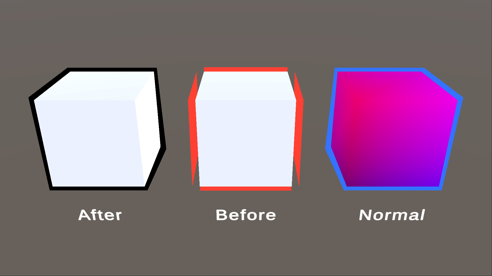
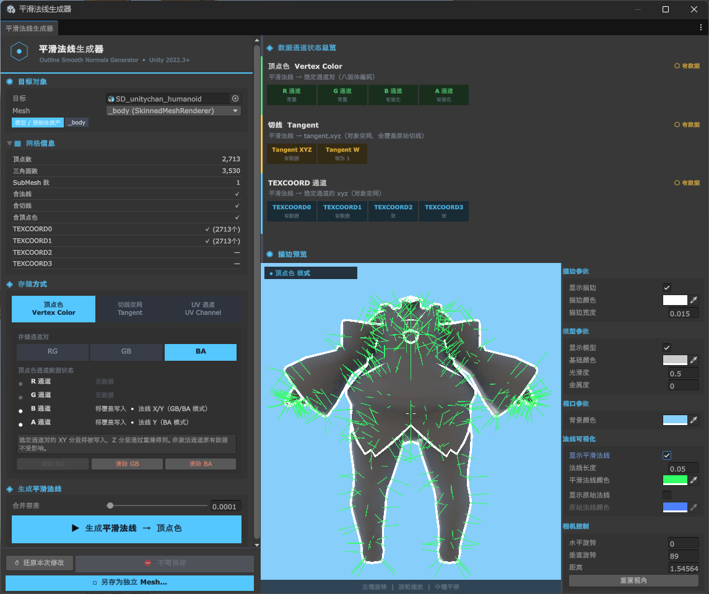

<p align="center">
  
  
  
  
  
</p>

<p align="center">
  🌍
  <a href="./README.md">中文</a> |
  <a href="./README_EN.md">English</a> |
  日本語
</p>

<p align="center">
  📥
  <a href="#-インストール">インストール</a> |
  <a href="#-クイックスタート">クイックスタート</a> |
  <a href="Packages/com.alefeng.outlinesmoothnormalsgenerator/README.md">詳細ドキュメント</a>
</p>

# Outline Smooth Normals Generator - スムース法線アウトライン生成ツール
Outline Smooth Normals Generator は、メッシュの**スムース法線**を自動計算し、頂点カラー・接線・UV チャンネルのいずれかにベイクする `Unity` 向けの**エディター拡張ツール**です。  
これは**背面押し出しアウトライン（Backface Outline）がハードエッジで割れる**問題を専門に解決します。トゥーン／アニメ調では「モデルを複製し、法線方向に押し出して背面だけを描画する」手法でアウトラインを生成するのが一般的ですが、キューブの角や機械的なエッジなど**法線が分割（Split Normals）されている**箇所では、頂点ごとの法線の向きが不連続になり、アウトラインに割れ目や隙間が生じます。  
本ツールは**同じ位置を共有する頂点**をまとめ、それらが属する面法線を**角度で重み付けして平均**することで、ハードエッジをまたいで連続した一本の「押し出し方向」（スムース法線）を求めます。シェーディング用の元の法線はそのまま保持されるため、アウトラインはモデルのシルエットに沿って滑らかに閉じます。  
ツール本体は純粋なエディター C# で、**レンダーパイプラインに依存しません**。アウトラインシェーダーはパイプライン別に Sample として提供され（URP / Built-in）、必要な方だけをインポートします。そのためパッケージ自体はどのパイプラインにも依存しません。ツールにはリアルタイムのアウトラインプレビューが内蔵されています。



## 📜 目次
- [概要](#概要)
  - [特徴](#特徴)
  - [なぜスムース法線が必要か](#なぜスムース法線が必要か)
- [💻 動作環境](#-動作環境)
- [📦 インストール](#-インストール)
- [🚀 クイックスタート](#-クイックスタート)
  - [1. ツールを開く](#1-ツールを開く)
  - [2. 対象と保存方式を選ぶ](#2-対象と保存方式を選ぶ)
  - [3. 生成してプレビュー](#3-生成してプレビュー)
  - [4. 保存](#4-保存)
- [🧩 3 つの保存方式](#-3-つの保存方式)
- [🎨 ゲーム内でアウトラインを使う](#-ゲーム内でアウトラインを使う)
- [📖 詳細ドキュメント](#-詳細ドキュメント)
- [📁 ディレクトリ構成](#-ディレクトリ構成)
- [📋 今後の予定](#-今後の予定)
- [📄 ライセンス](#-ライセンス)

## 概要
アウトラインはトゥーンレンダリングで最もよく使われる要素の一つです。最も汎用的な実装は**背面押し出し法**です。モデルを頂点法線方向に外側へ「膨らませ」、背面だけを描画することで、はみ出した縁がアウトラインになります。  
この手法はシンプルで高速ですが、頂点法線の**連続性**に強く依存します。モデルにハードエッジ（位置を共有しつつ法線が異なる隣接面、すなわち Split Normals）があると、同じ位置に向きの異なる複数の法線が存在し、押し出すと互いにずれて、角の部分でアウトラインが**割れて途切れます**。  

Outline Smooth Normals Generator は、エディターのワークフローでこれを解決します。

1. **スムース法線を計算** —— **同じ位置**を共有するメッシュ頂点をグループ化し、それらが属する面法線を**角度で重み付けして平均**することで、ハードエッジをまたぐ連続した一本の「押し出し方向」を求めます。
2. **メッシュへベイク** —— スムース法線を**頂点カラー／接線／UV** のいずれか一箇所へ書き込みます。ライティングに使う元の法線には手を加えません。
3. **シェーダーでサンプリングして押し出し** —— アウトラインシェーダーが頂点段階でこのスムース法線を読み取り、スクリーンスペースで等幅のオフセットを与えることで、滑らかに閉じたアウトラインが得られます。

一連の処理はすべてエディター内で行われ、**リアルタイムプレビュー、法線の可視化比較、チャンネル状態チェック、Undo、チャンネル単位のクリア**に対応します。



### 特徴
| 特徴 | 説明 |
| --- | --- |
| 角度重み付けスムース法線 | 頂点を「位置が等しい」ことでグループ化し、面法線を角度で重み付けして平均。ハードエッジをまたぐ連続した押し出し方向を生成し、アウトラインの割れを根本から解消します。背面・両面メッシュの巻き順の向きも自動補正します。 |
| 3 つの保存方式 | **頂点カラー**（RG / GB / BA のペアを選択可、八面体エンコード）、**接線**（`tangent.xyz`）、**TEXCOORD0–7**（8 チャンネル）。いずれもオブジェクト空間の完全な三次元方向を格納し、圧縮による曖昧さがありません。 |
| インポート時の自動ベイク | ファイル名が接尾辞（既定 `_Outline`）に一致するモデルを、（再）インポート時に自動でスムース法線をベイク。**非破壊的**で手動操作は不要。ツールの「インポート自動ベイク」タブで設定（`ProjectSettings/` に保存）。カスタム判定ルール／カスタム保存の 2 つの拡張デリゲートも提供します。 |
| メッシュ健全性チェック | 生成／ベイク前に、法線欠落・退化三角形・NaN・同一位置への頂点重複過多・Read/Write 無効などを走査して報告。エラー時は生成前に再確認、自動ベイク時は自動スキップします。 |
| リアルタイムアウトラインプレビュー | 埋め込み型プレビュービューポート。左ドラッグで回転／ホイールでズーム／中ドラッグでパン。アウトラインの幅・色、モデルのスムースネス／メタリック／ベースカラー、背景色をリアルタイムで調整できます。 |
| 法線の可視化比較 | 「スムース法線」と「元の法線」の線分を同時に重ねて表示し、ハードエッジでの向きの差を直感的に比較して、その場で結果を検証できます。 |
| データチャンネル状態の一覧 | 各チャンネルが「● スムース法線あり／○ 元データあり／✕ 空」のいずれかをリアルタイム表示し、既存の頂点カラーや UV データの誤上書きを防ぎます。 |
| メッシュ情報パネル | 頂点数・三角形数・サブメッシュ数、および法線／接線／頂点カラー／各 UV チャンネルの有無を一目で確認できます。 |
| データ安全性 | 読み取り専用のインポート済みアセットへの**「保存できたふり」を阻止**し、「独立した Mesh として保存」でワンクリックに書き込み可能な `.asset` を複製してオブジェクトへ再割り当てします。加えてセッションスナップショットによる「今回の変更を元に戻す」も用意。 |
| 結合トレランス | 継ぎ目の頂点は DCC 書き出しや FBX の浮動小数点丸めにより 1e-6 程度ずれるのが普通です。トレランス（既定 0.0001）により正しく結合されます。 |
| アウトラインシェーダー（Sample） | URP 版と Built-in 版を個別に提供。いずれも 2 パス（アウトライン＋基本的な NPR シェーディング）で、カスタムマテリアルパネルから法線ソースとアウトライン幅モード（スクリーン／ワールドスペース）を切り替え可能。 |
| 幅広い互換性 | 対象はシーン内のオブジェクト（`MeshFilter` / `SkinnedMeshRenderer`）に加え、Project 内の Mesh / モデル / プレハブアセットでも構いません。生成ロジックはレンダーパイプラインに依存しません。 |
| ローカライズ UI | エディター UI は中国語で提供され、パラメーターの説明と状態表示付きです。 |

### なぜスムース法線が必要か
- **通常法線アウトライン**：ハードエッジでは頂点ごとの法線の向きが一致しないため、押し出すとアウトラインがずれて割れます。特に角で顕著です。
- **スムース法線アウトライン**：同じ位置の頂点が一本の押し出し方向を共有するため、アウトラインはシルエットに沿って滑らかに閉じます。一方でシェーディングは元の法線を使い続けるので、**通常のライティングやノーマルマップには影響しません**。

そのためスムース法線は、空いているチャンネルに「押し出し方向」の追加データとして格納するだけの、低コストで非侵襲的な解決策です。

## 💻 動作環境
- `Unity 2022.3` 以降（`2022.3` と `6000.3` で動作確認済み。本リポジトリは `6000.3` でメンテナンスしています）。
- **生成ツール**（スムース法線の計算と書き込み）は純粋なエディター C# で、**どのレンダーパイプラインにも依存しません**。Built-in / URP / HDRP のいずれでもデータのベイクに使えます。
- **アウトラインシェーダーはパイプライン別に Sample として提供**されます（URP / Built-in）。コアパッケージにシェーダーは含まれないため、パイプライン依存が発生しません。HDRP 版は未提供です。[詳細ドキュメント](Packages/com.alefeng.outlinesmoothnormalsgenerator/README.md)を参照してアウトライン Pass を移植してください —— デコードのロジックは共通で、描画 Pass のみ適合させれば済みます。
- `OutlinePreview.shader` はエディター内プレビュー専用です。製品用途には使用しないでください。

## 📦 インストール
### UPM を使う（推奨）
`Window > Package Manager` → 左上の `+` → `Install package from git URL...` → 以下を貼り付け：

```
https://github.com/AleFeng/OutlineSmoothNormalsGenerator.git?path=/Packages/com.alefeng.outlinesmoothnormalsgenerator
```

これで `main` の最新コミットがインストールされます。**バージョンを固定するには、URL の一番最後に `#<タグ>` を付けます**（必ず `?path=` の後ろ）：

```
https://github.com/AleFeng/OutlineSmoothNormalsGenerator.git?path=/Packages/com.alefeng.outlinesmoothnormalsgenerator#1.4.0
```

利用可能なタグは [Releases](https://github.com/AleFeng/OutlineSmoothNormalsGenerator/releases) を参照してください。

### アウトラインシェーダーのインポート（必須）
コアパッケージにシェーダーは**含まれません**。インストール後、Package Manager で本パッケージを選択 →
`Samples` → **自分のプロジェクトのパイプラインに合う方をインポート**してください：

| Sample | シェーダー名 |
| --- | --- |
| Outline Shader (URP) & Demo | `OutlineSmoothNormalsGenerator/Outline URP` |
| Outline Shader (Built-in RP) & Demo | `OutlineSmoothNormalsGenerator/Outline Built-in` |

名前が異なるため共存できますが、プロジェクトのパイプラインは 1 つなので通常は該当する方だけで十分です。
各 Sample には比較用のデモシーンが付属します。

### その他の方法
リポジトリをダウンロードし、`Packages/com.alefeng.outlinesmoothnormalsgenerator` フォルダーごと
プロジェクトの **`Packages/` ディレクトリ**（`Assets/` ではありません）へコピーすることもできます ——
Unity がローカルパッケージとして自動的に認識します。

この場合 `Samples~` は Unity にインポートされないため（`~` で終わるディレクトリは無視されます）、
`Samples~/URP/`（または `Samples~/BuiltIn/`）の中身を `Assets/` 以下の任意の場所へ手動でコピーしてください。
**シェーダーの編集は不要です** —— 共有ライブラリを参照する `Packages/…` パスは、この配置でも解決されます。

インストールに成功すると、メニューバーに **`Tools → Smooth Normal Generator`** が表示されます。

## 🚀 クイックスタート
以下は最短の手順です。**より詳しいパラメーター解説とシェーダーのサンプリングコードは[詳細ドキュメント](Packages/com.alefeng.outlinesmoothnormalsgenerator/README.md)を参照してください。**

### 1. ツールを開く
メニューバー → `Tools → Smooth Normal Generator` で「スムース法線生成」ウィンドウを開きます。

### 2. 対象と保存方式を選ぶ
- 対象を選択するとツールが自動で読み込みます。対象は **シーン内のオブジェクト**（`MeshFilter` / `SkinnedMeshRenderer` を持つもの）のほか、Project 内の **Mesh アセット**、**モデル**（`.fbx` など）、**プレハブ** でも構いません。「対象」欄に手動でドラッグしてもかまいません。シーン内のオブジェクト・モデル・プレハブを選択すると、**階層全体をたどって**その中のすべてのメッシュを収集します。複数ある場合は、対象欄に **チェックボックスの一覧**（上部に「すべて選択 / クリア」、既定で全選択）が表示され、**複数のメッシュをチェックしてまとめて処理**できます。「生成 / 保存 / 別名で保存」はチェックしたすべてのメッシュに作用し、プレビューにもチェックした全メッシュが同時に表示されます。
- 「保存方式」で **頂点カラー／接線／TEXCOORD** を選びます（[3 つの保存方式](#-3-つの保存方式)を参照）。右側の「データチャンネル状態の一覧」で、対象チャンネルに既にデータがあるかを確認できます。

### 3. 生成してプレビュー
- **`▶ スムース法線を生成`** をクリックすると、データが `sharedMesh` に書き込まれます。
- 右側の「アウトラインプレビュー」ビューポートで結果をリアルタイム確認できます。左ドラッグで回転、ホイールでズーム、中ドラッグでパン。「スムース法線／元の法線を表示」をオンにすると重ねて比較できます。プレビューは実際の描画とまったく同じデコード処理を共有しているため、見たままの結果が得られます。
- 結果が思わしくなければ **`↺ 今回の変更を元に戻す`** で戻せます。

### 4. 保存
左下の **`保存`** ボタンをクリックし、変更を `.asset` へ書き戻します。

> ⚠️ **`.fbx` などのモデルファイル内のメッシュは読み取り専用のインポート済みサブアセット**です —— 書き込んだデータは次回の再インポート時に失われます。ツールはこれを検出して保存を阻止するので、まず **`⧉ 独立した Mesh として保存…`** で書き込み可能な `.asset` を複製してください。対象が**シーン内のオブジェクト**の場合は複製したメッシュが自動的に再割り当てされます。対象が**アセット**（Mesh / モデル / プレハブ）の場合は独立した `.asset` が作られるだけなので、ご自身で参照してください。
>
> ⚠️ `sharedMesh` を変更すると、そのメッシュを参照するすべてのオブジェクトに影響します。単一のオブジェクトだけに適用したい場合も、同じく複製機能を使ってください。

<!--  クイックスタート：選択 → 生成 → プレビュー -->

## 🧩 3 つの保存方式
スムース法線は常に**オブジェクト空間の完全な三次元方向**として格納されます。半球圧縮を行わないため、符号の曖昧さがなく、ハードエッジの角でもデコードを誤りません。

| モード | 格納先 | 適した場面 |
| --- | --- | --- |
| **頂点カラー Vertex Color** | `color` の RG / GB / **BA**（既定）ペア、八面体エンコード | 頂点カラーが空いている場合の第一候補。8-bit × 2 成分、誤差は約 1°。 |
| **接線 Tangent** | `tangent.xyz`（`w` は常に 1） | float の完全な精度。⚠ **元の接線を上書きしノーマルマップを壊します** —— そのメッシュがノーマルマップを使わない場合のみ選んでください。 |
| **TEXCOORD** | `TEXCOORD0`–`TEXCOORD7` の `xyz` | 頂点カラーが使用済みの場合の推奨、8 チャンネル。float の完全な精度。 |

> チャンネルは常に `TEXCOORDn` と呼び、`mesh.SetUVs(n)` のインデックスと恒等に対応します —— Unity 自身の `mesh.uv2` は実は `TEXCOORD1` であり、「UV1/UV2」という呼び方は容易に 1 つずれます。
>
> ⚠️ **`TEXCOORD0` はメインテクスチャの UV** です。書き込むとテクスチャマッピングが壊れます。既定は `TEXCOORD1` で、`TEXCOORD0` への書き込みには明示的な確認が必要です。

## 🎨 ゲーム内でアウトラインを使う
自分のパイプラインの Sample をインポートした後（2 パス：Pass0 背面押し出しアウトライン＋Pass1 基本的な NPR シェーディング）：

1. モデル用に新しいマテリアルを作成し、シェーダーを `OutlineSmoothNormalsGenerator/Outline URP`（または `… /Outline Built-in`）に設定します。
2. マテリアルパネルの **Smooth Normal Source** で、**生成時と同じ**保存チャンネルを選びます。頂点カラーモードでは **Vertex Color Channel** も同じペアに設定してください。
3. アウトラインの色と幅を調整します。**幅モード**は **スクリーンスペース**（等幅・距離に依存しない）または **ワールドスペース**（ワールド単位でオフセットし、距離とともに縮小）から選べます。

`VertexNormal` モードは元の頂点法線に沿って押し出します。つまり「本ツールを使わない場合」の見た目で、直接比較に使えます。

自作のメインマテリアルを使う場合は、**OUTLINE Pass** をそこへコピーするだけです。デコードを自前で書き写すのではなく、パッケージ内の `Shader/OutlineSmoothNormals.hlsl` を `#include` することを推奨します —— チャンネルごとのサンプリングコードは[詳細ドキュメント](Packages/com.alefeng.outlinesmoothnormalsgenerator/README.md#shader-中读取平滑法线)にあります。

## 📖 詳細ドキュメント
この README は全体の紹介とクイックスタートを目的としています。**完全な使用ガイド**——各保存方式の詳細、チャンネル選択、シェーダーのサンプリングコード、データのクリア、注意事項など——はプラグイン内のドキュメントにあります。

👉 **[Packages/com.alefeng.outlinesmoothnormalsgenerator/README.md](Packages/com.alefeng.outlinesmoothnormalsgenerator/README.md)**（中国語）

## 📁 ディレクトリ構成
```
Packages/com.alefeng.outlinesmoothnormalsgenerator/     ← パッケージルート
├── package.json  CHANGELOG.md  LICENSE.md
├── README.md                                     ← 詳細な使用ドキュメント
├── Editor/
│   ├── OutlineSmoothNormalsGeneratorWindow.cs    ← メインウィンドウ（埋め込みリアルタイムプレビュー付き）
│   ├── OutlineSmoothNormalsCalculator.cs         ← スムース法線計算（角度重み付け＋トレランス結合）
│   ├── OutlineSmoothNormalsCodec.cs              ← 保存フォーマットのコーデック（.hlsl の C# ミラー）
│   ├── StorageWriter.cs                          ← 頂点カラー / 接線 / TEXCOORD への書き込み
│   ├── OutlineShaderGUI.cs                       ← カスタムマテリアルインスペクター
│   ├── Shader/OutlinePreview.shader              ← エディタープレビュー専用
│   └── OutlineSmoothNormalsGenerator.Editor.asmdef
├── Shader/
│   └── OutlineSmoothNormals.hlsl                 ← デコード＋押し出し処理の【唯一の真源】
└── Samples~/
    ├── URP/                                      ← Sample：URP アウトラインシェーダー＋デモシーン
    └── BuiltIn/                                  ← Sample：Built-in アウトラインシェーダー＋デモシーン
```

> `OutlineSmoothNormals.hlsl` はエディタープレビューと両パイプラインのアウトラインシェーダーで共有されます。デコード処理はこの 1 つだけなので、「プレビューは正しいのに実際の描画が違う」は構造的に起こり得ません。

## 📋 今後の予定
- HDRP 版のアウトラインシェーダーを提供。
- 複数メッシュ／フォルダー全体のバッチ処理。
- より多彩なアウトラインスタイル（深度に応じた幅、マテリアル別の色付けなど）。

## 📄 ライセンス
本プロジェクトは [MIT License](LICENSE) の下でオープンソース化されており、商用・非商用を問わず自由に利用できます。
